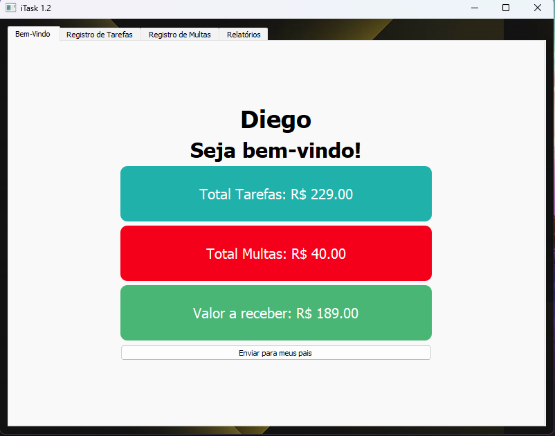
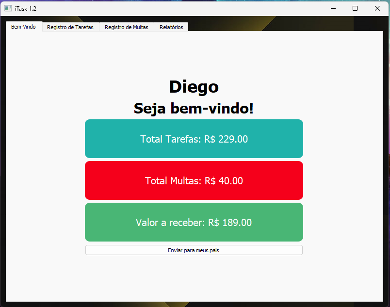
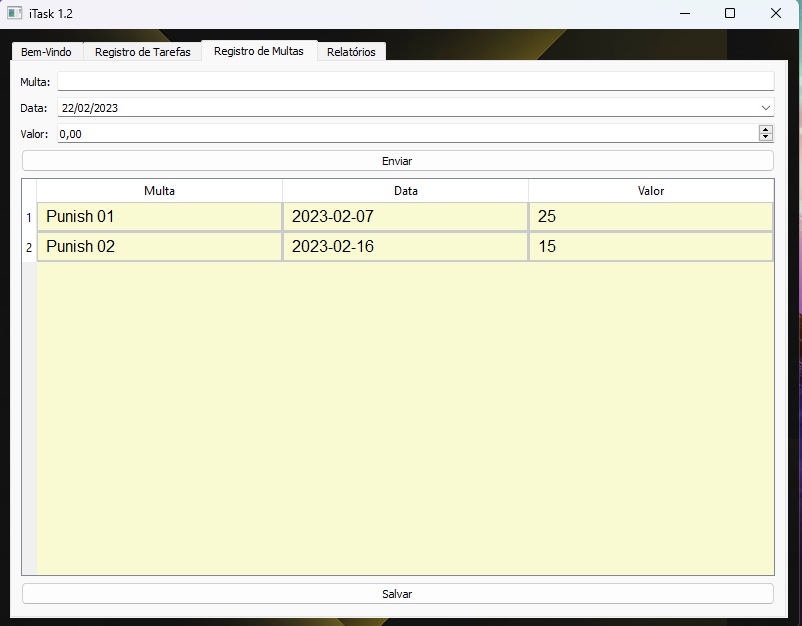
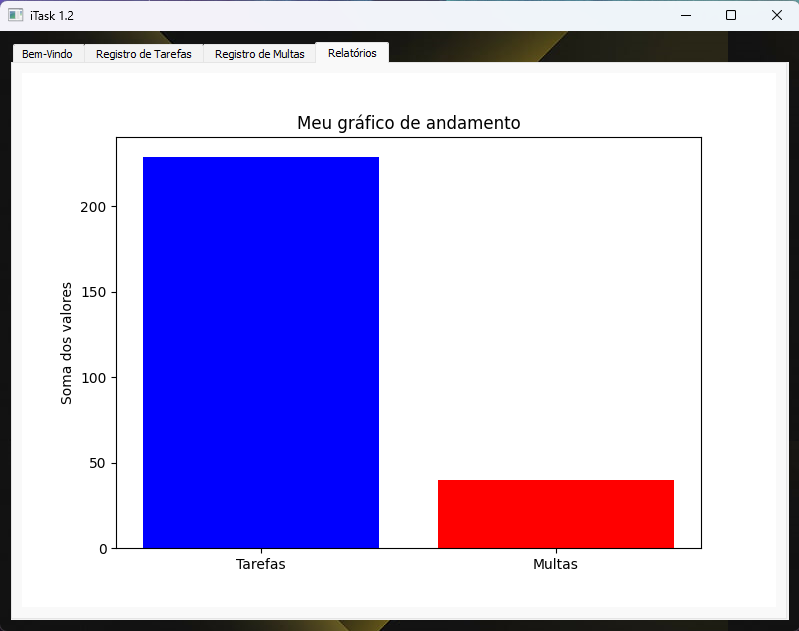
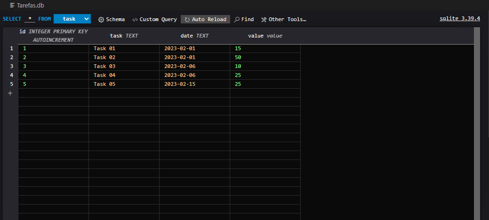

# Welcome to iTask 1.2

The iTask project is a project of mine, where the idea was to create something from scratch to understand all the logic of and study the Python programming language and its dependencies.
The premise of the project came from helping my son manage to organize his payments for tasks and his punish (which are punishments applied in relation to what he earns for fulfilling something within our daily life).

As his "allowance" works, he has chores to do at home: help take out the garbage, help take care of the pets, get good grades at school, pass the year, do the dishes, help keep the house clean and help clean the house on cleaning days. Each task has its own value, and today he is putting the information together in an excel spreadsheet, but iTask will help him to have a more interactive view and help organize his financial life (a 15-year-old teenager.)

So thinking about that came the idea for my study, to create something that could help him and bring a challenge for me to be able to create and learn.

To be able to create the .exe file, just use the following command in the terminal in the root folder of the project:
pyinstaller --onefile --windowed --icon='c://path/file.ico' iTask.py

## News...
Now the export to excel function, in addition to saving the spreadsheet locally, also sends a summary and the file by email.

Check requirements.txt file for required libraries.

## YouTube Video (Version 1.0): https://youtu.be/tF78CP-x504
## YouTube Video (Version 1.1): https://youtu.be/b7lem1wA37s
## YouTube Video (Version 1.2): https://youtu.be/uFQaaJ4odgI

# iTask screens

## New screens

## Welcome tab

When opening the application, a welcome message is shown and three cards with the summed values of tasks, punish and how much you have to receive at the end of the cycle of tasks (think it would be per month, from the first day to the last day of the month chain).
The cards are updated as the application is opened, to reflect the values it takes from the database the information of the sum of the value column of each database table.

## Tasks Tab

This screen is where task records take place, there is a simple form to insert the task title (text type field), date (date type field with mask) and value (value type field and accepts decimal numbers).

Button to send form data to the table.

We also have the part where the table is created (still without formatting, but this will be improved over time, in the next versions).

Button to save the table in the database and finally the button to export it to an Excel file.
The export button has a double function, in addition to exporting it cleans the bank, to start a new cycle of tasks and punish.

## Punish tab

This screen is where punish are registered, there is a simple form to insert the title of the fine (text type field), date (date type field with mask) and value (value type field and accepts decimal numbers).

Button to send form data to the table.

We also have the part where the table is created (still without formatting, but this will be improved over time, in the next versions).

Button to save the table in the database and finally the button to export it to an Excel file.
The export button has a double function, in addition to exporting it cleans the bank, to start a new cycle of tasks and punish.

## Report tab

A tab to show the total amount of tasks and punish in a bar graph.

## Database

Database created in SQLite3 containing two tables, the file is created automatically when opening the application for the first time.

# Bem-vindo ao iTask 1.2

O projeto iTask é um projeto de autoria minha, onde a ideia foi criar algo do zero para entender toda a lógica de e estudar a linguagem de programação Python e suas dependências.
A premissa do projeto surgiu em ajudar meu filho a conseguir organizar seus pagamentos por tarefas e suas multas (que são castigos aplicados em relação ao que ele ganha por cumprir algo dentro do nosso cotidiano).

Como funciona a "mesada" dele, ele tem tarefas de casa a serem cumpridas: ajudar a retirar o lixo, ajudar cuidar dos animais de estimação, ter notas boas na escola, passar de ano, lavar louça, ajudar a manter a casa limpa e ajudar a limpar a casa nos dias de faxina. Cada tarefa tem seu valor, e ele vai unindo hoje a informação em uma planilha de excel, porém o iTask vai ajuda-lo a ter uma visão mais interativa e auxiliar nessa função de organizar a vida financeira dele (um adolecente de 15 anos.)

Então pensando nisso que veio a ideia para meu estudo, criar algo que pudesse ajuda-lo e trouxesse um desafio para eu poder criar e aprender.

Para poder criar o arquivo .exe basta usar o seguinte comando no terminal na pasta raiz do projeto:
pyinstaller --onefile --windowed --icon='caminho do arquivo.ico' iTask.py

## Novidades
Agora a função de exportar para o excel além de salvar a planilha localmente, também enviar por e-mail um resumo e o arquivo.

Verificar arquivo requeriments.txt para bibliotecas necessárias.

# Telas do iTask

## Novas telas

## Aba de Boas-vindas

Ao abrir o aplicativo é mostrado uma mensagem de boas vindas e três cards com os valores somados de tarefas, multas e o quanto tem a receber ao final do ciclo de tarefas (pense que seria por mês, do primeiro dia até o ultimo dia do mês corrente).
Os cards são atualizados conforme o aplicativo é aberto, para refletir os valores ele pega a partir do banco de dados a informação da soma da coluna valor de cada tabela do banco de dados.

## Aba de Tarefas

Nessa tela é onde acontecem os registros de tarefas, há um formulário simples para inserir o titulo da tarefa(campo tipo texto), data (campo tipo data com mascara) e o valor (campo do tipo valor e aceita numeros decimais).

Botão para enviar os dados do formulário para a tabela.

Temos também a parte onde é criada a tabela (ainda esta sem formatação, mas isso será melhorado com o tempo, nas próximas versões).

Botão para salvar a tabela no banco de dados e por ultimo o botão para exportar para o arquivo Excel.
O botão para exportar tem uma função dupla, além de exportar ele limpa o banco, para se iniciar um novo ciclo de tarefas e multas.

## Aba de Multas

Nessa tela é onde acontecem os registros de multas, há um formulário simples para inserir o titulo da multa(campo tipo texto), data (campo tipo data com mascara) e o valor (campo do tipo valor e aceita numeros decimais).

Botão para enviar os dados do formulário para a tabela.

Temos também a parte onde é criada a tabela (ainda esta sem formatação, mas isso será melhorado com o tempo, nas próximas versões).

Botão para salvar a tabela no banco de dados e por ultimo o botão para exportar para o arquivo Excel.
O botão para exportar tem uma função dupla, além de exportar ele limpa o banco, para se iniciar um novo ciclo de tarefas e multas.

## Aba Relatório

Uma aba para mostrar o valor total das tarefas e multas em um gráfico de barras.

## Banco de dados 

Banco de dados criado em SQLite3 contendo duas tabelas, o arquivo é criado automaticamente ao abrir a primeira vez o aplicativo.

## YouTube Video (Version 1.0): https://youtu.be/tF78CP-x504
## YouTube Video (Version 1.1): https://youtu.be/b7lem1wA37s
## YouTube Video (Version 1.2): https://youtu.be/uFQaaJ4odgI